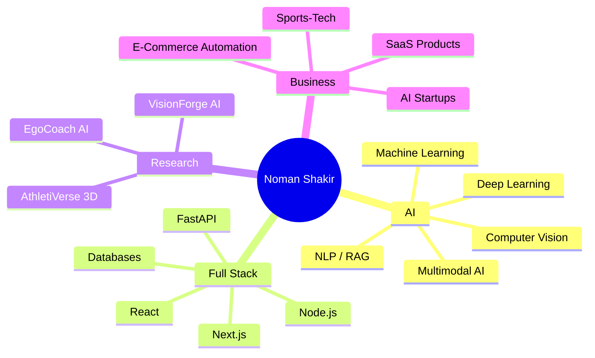

  

  

<!-- Animated profile view counter -->

    

      <h3>Live Profile Views</h3>
      

        
      

    

  

---

<table>
<tr>
<td width="58%">

## 🧑‍🚀 About Me

I am **Noman Shakir**, a **Software Engineering student at COMSATS University Islamabad, Abbottabad Campus**.

I build intelligent, scalable, and product-focused software systems using **AI, Computer Vision, NLP/RAG, Full-Stack Development, and Visual Computing**.

My mission is to become an:

### **AI Researcher • Software Engineer • Startup Builder**

I do not only want to write code. I want to build real AI products that help people **train better, learn faster, automate work, and solve real-world problems**.

</td>
<td width="42%" align="center">

 

</td>
</tr>
</table>

---

## 🧠 Current Focus

| 🚀 Area | 🔥 What I Am Building |
|---|---|
| **Final Year Project** | **EliteFootX** — AI-driven football coaching platform |
| **MS Research Direction** | **VisionForge AI** — Deep Learning Visual Computing Studio |
| **Computer Vision** | Segmentation, image/video understanding, depth estimation, visual AI |
| **NLP / RAG** | BERT, embeddings, semantic search, document-aware AI assistants |
| **Full-Stack AI** | Secure dashboards, APIs, auth, databases, cloud deployment |
| **Startup Vision** | Sports-tech, e-commerce automation, education AI, business intelligence |

---

## 🏆 Flagship Research Direction

### 👁️ VisionForge AI — Deep Learning Visual Computing Studio

**VisionForge AI** is my main research direction for MS and future AI product development.

It focuses on:

- 🖼️ Image and video understanding
- 🎯 Object detection and segmentation
- 🧠 Vision-language interaction
- 💬 Visual question answering
- 🧊 Depth estimation and 3D visual representation
- 🔐 Secure full-stack AI deployment
- ⚙️ AI product engineering for real users

> Goal: build AI systems that can **see, understand, explain, and visualize** real-world content.

---

## ⚽ Final Year Project — EliteFootX

<table>
<tr>
<td width="45%" align="center">

  

</td>
<td width="55%">

**EliteFootX** is my AI-driven football training and performance platform.

It helps players improve through:

- ⚽ Personalized AI coaching
- 📈 Player progress tracking
- 🧩 Drill history and performance patterns
- 🎮 XP, streaks, and gamified training
- 🧠 AI coach interaction
- 👁️ Future video/computer vision analysis

This project connects my interest in **football, AI, software engineering, and sports technology**.

</td>
</tr>
</table>

---

## 🧪 AI Internship Experience

I completed an **AI internship at Convo (Private) Limited, Islamabad**, in the **Data Science Department**.

During this internship, I gained practical exposure to:

- BERT-based NLP models
- Text analysis
- Text classification
- AI model workflows
- Real-world AI software environments

---

## 🛠️ Tech Arsenal

### 💻 Programming Languages

### 🌐 Full-Stack Development

### 🤖 AI / ML / Data / Computer Vision

  

### 🗄️ Databases, Tools & Cloud

---

## 🚀 Featured Project Galaxy

| 🌟 Project | 🧠 Category | ⚡ What It Does |
|---|---|---|
| **EliteFootX** | AI + Sports-Tech | AI football coaching, player progress, drills, XP, AI feedback |
| **VisionForge AI** | Computer Vision + Visual AI | Segmentation, VQA, depth estimation, 3D visual representation |
| **EgoCoach AI** | Video Understanding | Egocentric training video analysis and AI coaching feedback |
| **AthletiVerse 3D** | 3D AI + Sports-Tech | Pose estimation, 3D skeleton, training visualization |
| **Facial Expression Analyzer** | Computer Vision | Expression/emotion analysis using image processing and ML |
| **Celebrity Recognition System** | ML + CV | Recognition, feature extraction, classification |
| **Bangalore House Price Prediction** | Data Science | Regression-based house price prediction and analysis |

---

## 🧭 What I Am Learning Next

---

## 📈 GitHub Analytics

---

## 🏆 GitHub Trophies

---

## 📊 Contribution Activity

---

## 🧬 My Builder DNA

| 🧩 Mindset | 💬 Meaning |
|---|---|
| **Researcher** | I want to understand deeply, not just copy code |
| **Engineer** | I build working systems with APIs, databases, dashboards, and deployment |
| **Founder** | I think about users, products, markets, and business value |
| **Learner** | I keep improving through projects, communities, and self-study |
| **Problem Solver** | I want AI to solve real problems in sports, education, and business |

---

## 🌍 Long-Term Vision

I want to build AI-based products and startups in:

- ⚽ Sports technology
- 👁️ Visual computing
- 🤖 AI coaching systems
- 🎓 Education technology
- 🛒 E-commerce automation
- 📊 Business intelligence
- 🧍 Human performance improvement

> My dream is to build technology that helps people train better, learn faster, work smarter, and access intelligent tools regardless of where they come from.

---

## 🤝 Connect With Me

---

  
